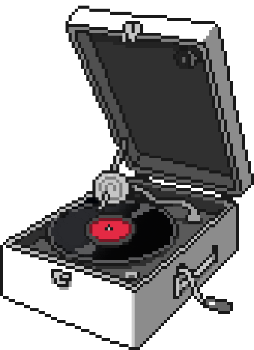

  
   
   
  
   
   

<table width="100%" align="center">
<tr>
<td align="center">
<a href="https://saulmrto.github.io">
<strong>Visit my webpage for more information</strong>
 
 
 

</a>

</td>

<td align="center">
<a href="">
<strong>Some good music to focus</strong>
 
 

 
</a>

</td>
</tr>
</table>

 

<!---

&nbsp;&nbsp;&nbsp;&nbsp;  

&nbsp;&nbsp;&nbsp;&nbsp;  

--->

